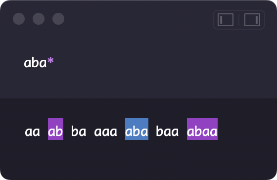
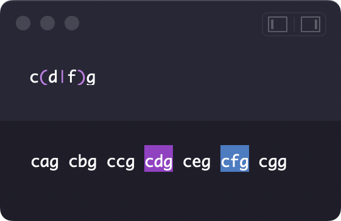

# 正規表現のはなし

宇佐見公輔
第25回日曜数学会（2022年10月15日）

<!-- _paginate: false -->
<!-- _footer: "" -->

# 自己紹介

* 宇佐見公輔（うさみこうすけ）
* 職業：プログラマ
* 趣味：数学

## 近況
* 第3回すうがく徒のつどい：講演（4月）
* iOSDC Japan 2022：登壇、技術記事執筆（6〜9月）
* 技術書典13：技術同人誌執筆（8〜9月）

# 正規表現とは

プログラミング言語で、文字列の検索（パターンマッチ）に使われる汎用的な文法。
テキストエディターなど各種ツールでの文字列検索機能でもよく使われる。

 

# 正規表現の記法

* 「`a`」は `a` にマッチ、「`b`」は `b` にマッチ
* 「`(a|b)`」は `a` または `b` にマッチ
* 「`[a-z]`」は `a`〜`z` のどれでもマッチ
* 「`.`」は任意の1文字にマッチ
* 「`a*`」は任意個の `a` からなる文字列にマッチ（空文字列、`a`、`aa`、、）
* 「`a+`」は1個以上の `a` からなる文字列にマッチ（`a`、`aa`、`aaa`、、）
* 「`(a|b)*`」は `aaa`、`abab`、`baab`、`bbbbb`、などにマッチ
* 「`.*`」は任意個の文字からなる文字列にマッチ

# 正規表現の基本三演算

正規表現は次の3つの演算で生成される。

* 連接：正規表現 $r$ と $s$ に対して、それを並べた $rs$
* 選択：正規表現 $r$ と $s$ に対して、そのどちらかにマッチする $(r|s)$
* 繰り返し：正規表現 $r$ に対して、その任意個の繰り返し $r*$

例：

* 「`a+`」は「`aa*`」と書ける
* 「`[a-z]`」は「`(a|b|c|...|z)`」と書ける
* 「`.`」はすべての文字の選択で書ける（※文字集合は有限集合）

# 余談：正規表現という言葉

正規表現は「regular expression」の訳だが・・・。

* 「regular」
    * 一般に「regular」は「正則」と訳されることが多そう
    * そもそも「regular」という言葉が妥当かどうか？
* 「expression」
    * 一般に「expression」は「式」と訳されることが多そう
    * 「表現」と言われると「representation」を連想するかも？

# 正規表現と集合

正規表現そのものを直接考える代わりに、集合で考える。

正規表現 $r$ にマッチする文字列の集合を $r$ の受理文字列集合と呼び、$L(r)$ と書く。

例：

* $L(\mathtt{a})=\{\mathtt{a}\}$
* $L(\mathtt{a|b})=\{\mathtt{a},\mathtt{b}\}$
* $L(\mathtt{aba*})=\{\mathtt{ab},\mathtt{aba},\mathtt{abaa},\mathtt{abaaa},\dots\}$

ある文字列が正規表現 $r$ にマッチするかという問題が、集合 $L(r)$ の元かという問題になる。

# 正規言語

文字列集合を定式化しておく（形式言語理論）。

* $\Sigma$：文字集合（有限集合とする）
* $\Sigma^*$：文字列（＝ $\Sigma$ の元を有限個並べたもの）全体の集合
    * 長さ $0$ の文字列を $\varepsilon$ と書くことにする（空文字列）
    * $\varepsilon\in\Sigma^*$ とする
    * たとえば、$\Sigma:=\{\mathtt{a},\mathtt{b}\}$ のとき $\Sigma^*=\{\varepsilon,\mathtt{a},\mathtt{b},\mathtt{aa},\mathtt{ab},\mathtt{ba},\mathtt{bb},\mathtt{aaa},\mathtt{aab},\dots\}$
* $\Sigma^*$ の部分集合 $L$ を言語と呼ぶ
* 言語 $L$ がある正規表現 $r$ の受理文字列集合 $L(r)$ と一致するとき、$L$ を正規言語と呼ぶ

# 正規言語の定式化

正規表現を使わずに正規言語を定義することができる。

* 空集合 $\emptyset$ は正規言語、空文字列のみの集合 $\{\varepsilon\}$ は正規言語
* $\sigma\in\Sigma$ について $\{\sigma\}$ は正規言語
* $L$ と $M$ が正規言語ならば、選択 $L+M:=L\cup M$ は正規言語
* $L$ と $M$ が正規言語ならば、連接 $LM:=\{xy\mid x\in L,y\in M\}$ は正規言語
* $L$ が正規言語ならば、Kleene閉包 $L^*$ は正規言語
* これらの条件にあらわれない言語は正規言語ではない

※Kleene閉包 $L^*$ は、$L$ の元を重複を許して有限個取り出して連接した文字列の全体からなる集合。

# 正規言語の代数構造

* 選択の結合法則 $(L+M)+N=L+(M+N)$
* 選択の交換法則 $L+M=M+L$
* 選択の単位元 $L+\emptyset=\emptyset+L=L$
* 連接の結合法則 $(LM)N=L(MN)$
* 連接の単位元 $L\varepsilon=\varepsilon L=L$
* 零元 $L\emptyset=\emptyset L=\emptyset$
* 分配法則 $L(M+N)=LM+LN$、$(L+M)N=LN+MN$

# 正規性の判定

$\Sigma$ 上の言語 $L$ があるとき、$\Sigma^*$ 上の同値関係 $\sim$ を次で定義する。

$$
x\sim y\iff \forall z\in\Sigma^*\left[xz\in L\iff yz\in L\right]
$$

## Myhill-Nerodeの定理

> $\Sigma$ 上の言語 $L$ が正規言語であることと、商集合 $\Sigma^*/\sim$ が有限集合であることは同値。

これを言語の正規性の判定に使うことができる。また、より条件が緩いポンピング補題を正規性の判定に使うことができる。

# より進んだ話題

* 有限オートマトン
    * 正規表現マッチングの計算モデルとして、有限オートマトンがある
    * 正規表現と決定性有限オートマトンは等価
* 正規性の利点
    * 最適化問題が決定問題であり、そのアルゴリズムの方法論も確立されている
* 非正規な正規表現
    * プログラミングで使われている正規表現のうち後方参照や再帰の記法は、実は正規ではない
* 形式言語理論
    * 形式言語の理論は、正規表現以外にもさまざまな応用がある

# 参考文献

   

※右端はiOSDC Japan 2022のセッション
