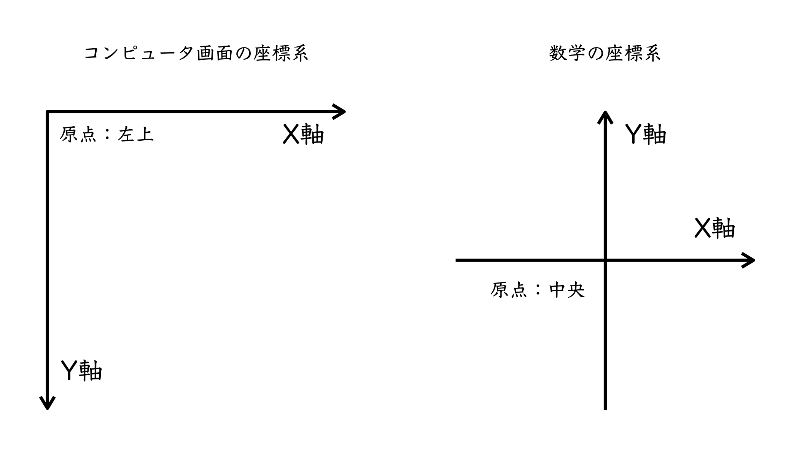
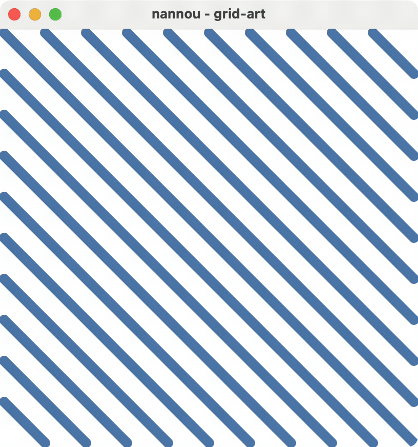
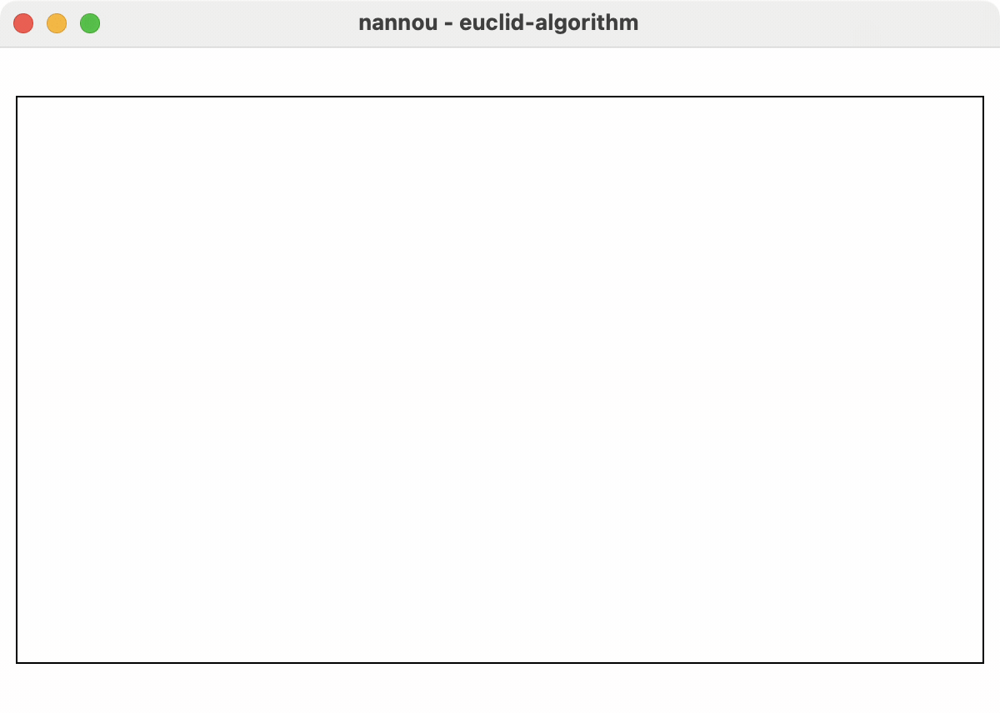

# クリエイティブコーディングのはなし
<!-- _paginate: false -->
<!-- _footer: "" -->

宇佐見公輔
第28回日曜数学会（2023年10月29日）

# 自己紹介

・宇佐見公輔（うさみこうすけ）
・職業：プログラマ
・趣味：数学

## 近況
・ソリトンとリー代数（第26回日曜数学会／2月）
・Onsager代数とその周辺（第4回すうがく徒のつどい／9月）

# クリエイティブコーディングとは

・何らかの表現を創造することを目的としたプログラミングのこと
・何らかの機能を実現することを目的としたものではない

<br>

・ビジュアルアートやサウンドアートなどの作品を制作する活動が行われている
・アルゴリズムや数学的なルールに基づいて作品を生成するジェネラティブアート

# ビジュアライズのツール

次のものが優れたツールとして存在している
・Desmos
・GeoGebra
これらはプログラミング言語を必要とせず、機能も強力

<br>

プログラミング好きなら、クリエイティブコーディングという選択肢もある

# クリエイティブコーディング向けツールキット

・Processing（Java or Python）
・p5.js（JavaScript）
・openFrameworks（C++）

<br>

これらは情報も多めで学習コストも低い。

# Nannou

Rust言語のクリエイティブコーディング向けツールキット
・Rust言語はモダンなプログラミング言語のひとつ
・開発環境が整備されているが、学習コストはやや高い

<br>

個人的な好みでこれを使っている。
（本業がプログラマなのが影響している）

# 座標系の違い



# 座標系の違い


コンピューター画面の座標系：
・画面に横書きの文章がある場合、左から右、上から下に向かっていくのが自然。

数学の座標系：
・地面にXY平面があって自分が原点に立っている場合、Y軸が自分から前に向かっていくのが自然。

※ Processingやp5.jsは左の座標系を採用。Nannouは右の座標系を採用。

# 例1


ランダムウォーク

・一歩の長さは一定
・進む方向はランダム
・方向で色を変える
・端に着いたら反射する

<br>

[GitHub](https://github.com/usami-k/coding-nannou/tree/main/2023/0002_randomwalk) / [Threads](https://www.threads.net/@usamik26/post/CyyXI1IxRH1)

# 例1のコード抜粋

```rust
    // 前回の終点を始点にする
    model.start = model.end;

    // 一歩進んだ先の点を求める
    let angle = model.rng.gen_range(0.0..2.0 * PI);
    let vec = vec2(angle.cos(), angle.sin()) * model.step_length;
    model.end = model.start + vec;

    // 角度から色相環を使って色を決める
    model.fg_color = hsl(angle as f32 / (2.0 * PI), 0.5, 0.5);
```

```rust
    draw.line()
        .color(model.fg_color)
        .start(model.start)
        .end(model.end);
```

# 例2



格子から模様をつくる

・$10×10$の格子分割
・各マスに斜線を描く
・一定時間経過で、ランダムに一箇所の向きを変える

<br>

[GitHub](https://github.com/usami-k/coding-nannou/tree/main/2023/0003_grid-art) / [Threads](https://www.threads.net/@usamik26/post/Cy3gYl-xLdo)

# 例2のコード抜粋

```rust
    model.row = model.rng.gen_range(0..10);
    model.col = model.rng.gen_range(0..10);
    model.grid[model.row][model.col] += 1;
```

```rust
    for row in 0..10 {
        for col in 0..10 {
            let direction = model.grid[row][col] % 2;
            let left = -200.0 + row as f32 * 40.0;
            let bottom = -200.0 + col as f32 * 40.0;
            draw.line()
                .start(pt2(left, bottom + 40.0 - 40.0 * direction as f32))
                .end(pt2(left + 40.0, bottom + 40.0 * direction as f32))
                .color(STEELBLUE)
                .weight(10.0)
                .caps(LineCap::Round);
        }
    }
```

# 例3



ユークリッドの互除法

$580$ と $340$ の最大公約数
* $580=340×1+240$
* $340=240×1+100$
* $240=100×2+40$
* $100=40×2+20$
* $40=20×2+0$

<br>

[GitHub](https://github.com/usami-k/coding-nannou/tree/main/2023/0004_euclid-algorithm) / [Threads](https://www.threads.net/@usamik26/post/Cy8oUeoRwYB)

# 例3のアルゴリズム

一定時間経過のたびに、次の処理を行う。
・$a$ と $b$ のどちらかが $0$ なら何もしない。
・$a≥b$ なら、一辺 $b$ の正方形を描いて $a$ から $b$ を引く。
・$a<b$ なら、一辺 $a$ の正方形を描いて $b$ から $a$ を引く。

<br>

一定時間ごとに1ステップ進めることでアニメーションとして見せる。

# 参考文献

  
